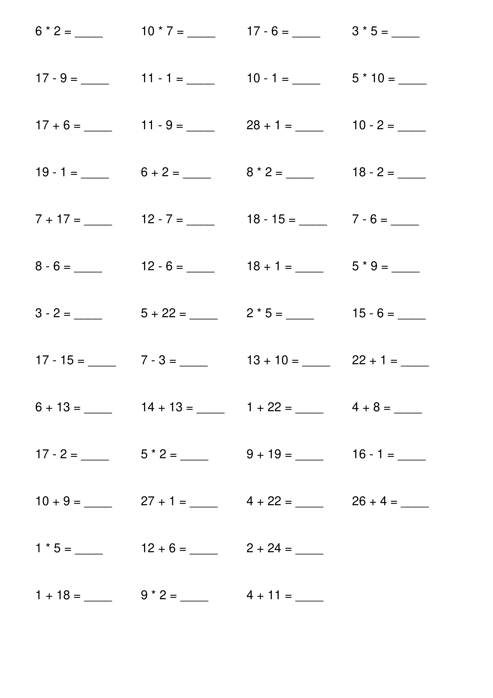
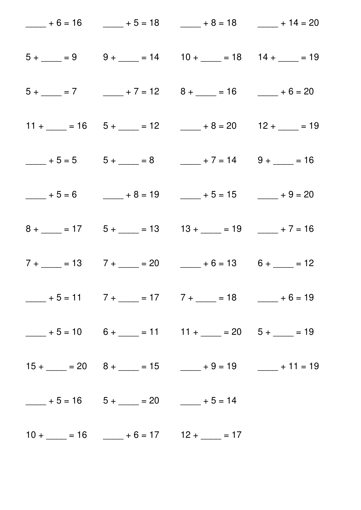
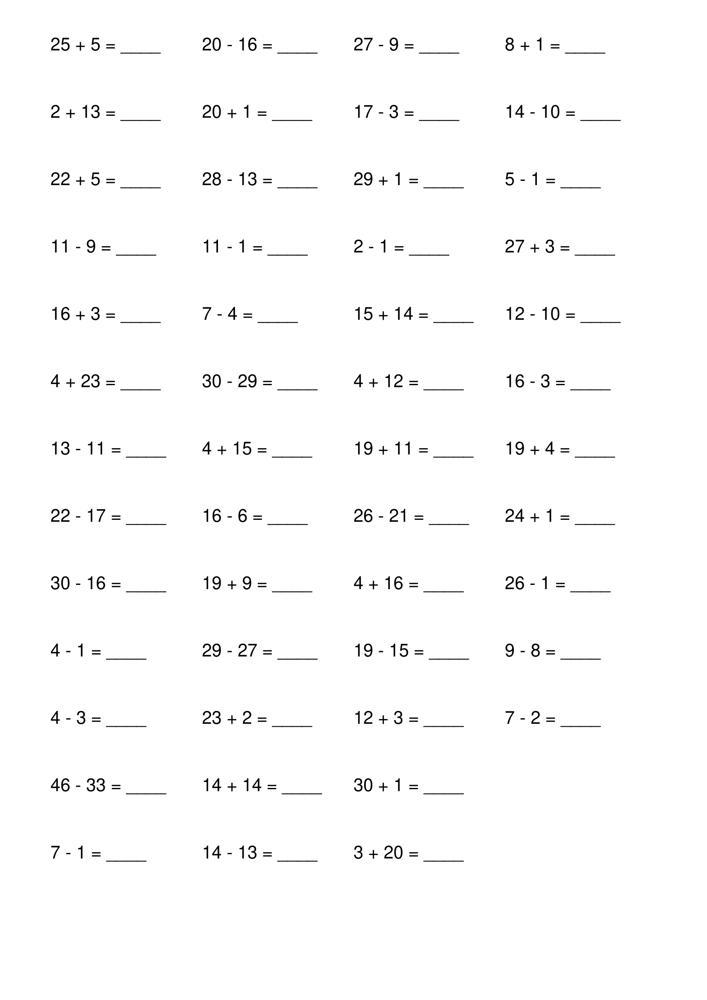

# Math equations test generator

This script generates pdf with simple equations for children to train on.

### Plus, minus and basic multiplying

### Equations with blanks

### Basic plus/minus

[comment]: <> (&#40;с&#41; ChernV &#40;otter18&#41;, 2022)

[comment]: <> (Go to https://github.com/otter18 for more info)